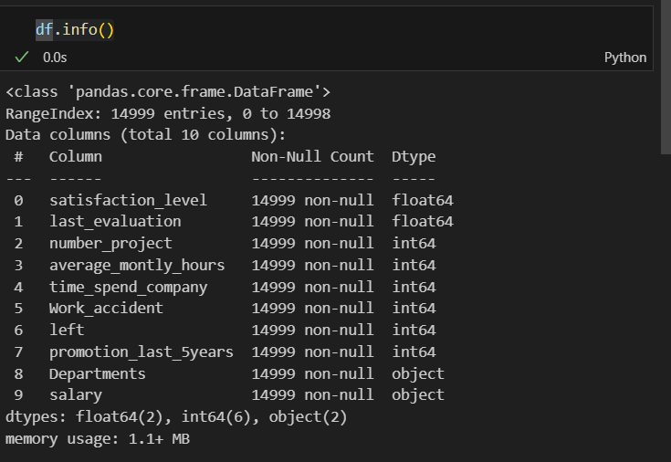
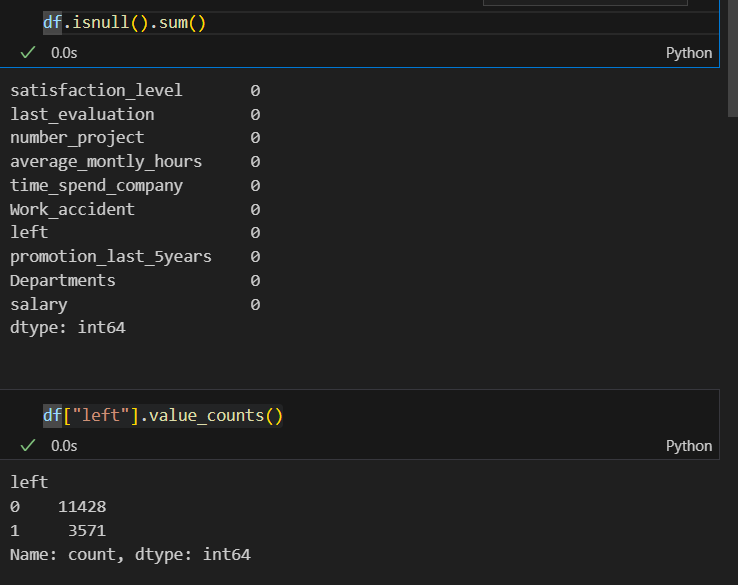
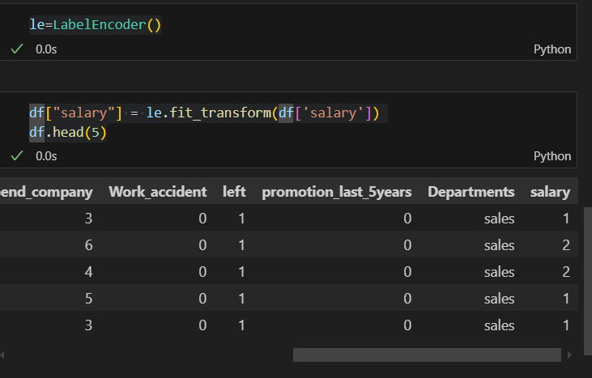
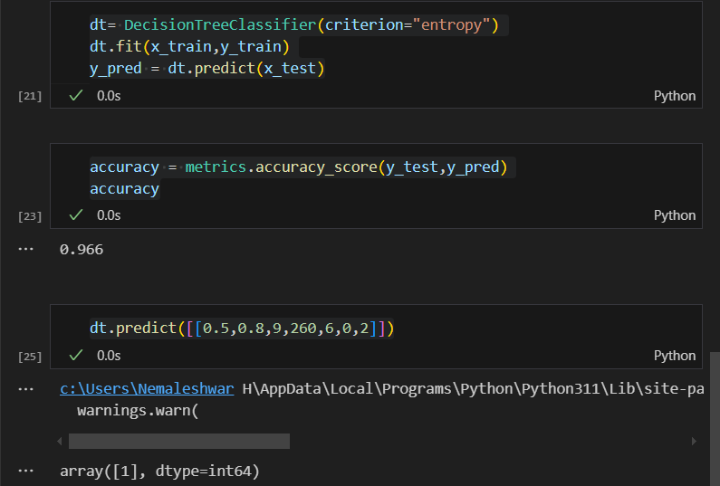

# Implementation-of-Decision-Tree-Classifier-Model-for-Predicting-Employee-Churn

## AIM:
To write a program to implement the Decision Tree Classifier Model for Predicting Employee Churn.

## Equipments Required:
1. Hardware – PCs
2. Anaconda – Python 3.7 Installation / Jupyter notebook

## Algorithm
1. Importing necessary liberaries
2. Data Reading and cleaning
3. Splitting data into train and testing
4. import Decision tree algorithm from skleaarn

## Program:
```
/*
Program to implement the Decision Tree Classifier Model for Predicting Employee Churn.
Developed by: Nemaleshwar H
RegisterNumber:  21223230142
*/
```
# importing liberaries
```py
import pandas as pd
from sklearn.preprocessing import LabelEncoder
from sklearn.model_selection import train_test_split
from sklearn.tree import DecisionTreeClassifier
from sklearn import metrics
```
# data reading
```py
df = pd.read_csv('Employee (1).csv')
df.head(5)
df.info()
```
# data cleaning
```py
df.isnull().sum()
df["left"].value_counts()
le=LabelEncoder()
df["salary"] = le.fit_transform(df['salary'])
df.head(5)
```
# train and test split
```py
x= df[['satisfaction_level'	,'last_evaluation'	,'number_project'	,'average_montly_hours' ,'Work_accident'	,'promotion_last_5years', 'salary'	]]
y =df['left']
x_train,x_test,y_train,y_test = train_test_split(x,y,test_size=0.2,random_state=2)
```
# importing algorithm
```py
dt= DecisionTreeClassifier(criterion="entropy")
dt.fit(x_train,y_train)
y_pred = dt.predict(x_test)
accuracy = metrics.accuracy_score(y_test,y_pred)
accuracy
```
```py
dt.predict([[0.5,0.8,9,260,6,0,2]])
```

## Output:





## Result:
Thus the program to implement the  Decision Tree Classifier Model for Predicting Employee Churn is written and verified using python programming.
